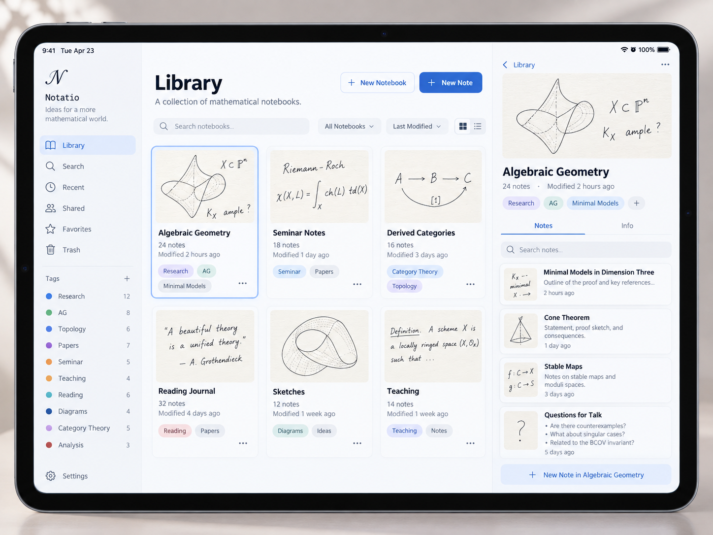
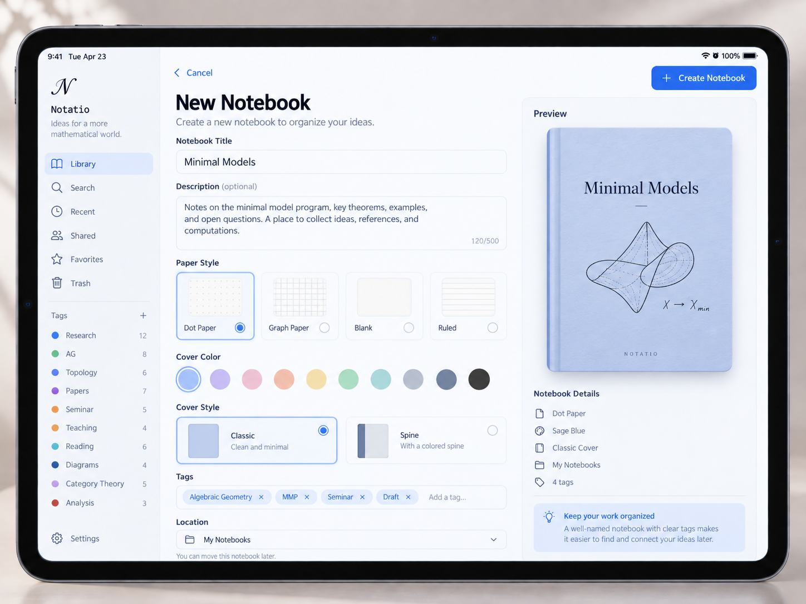
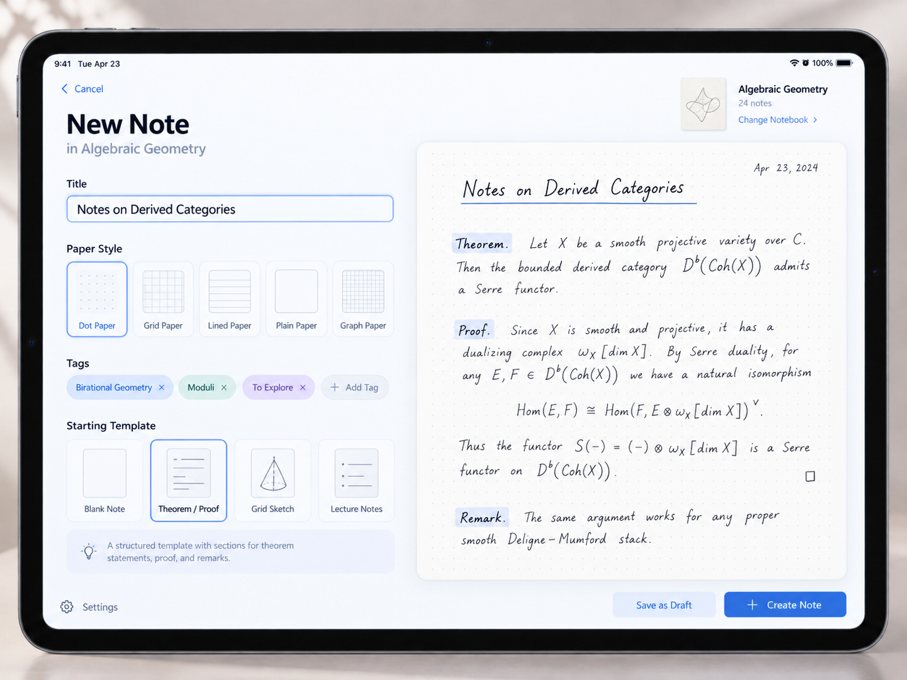
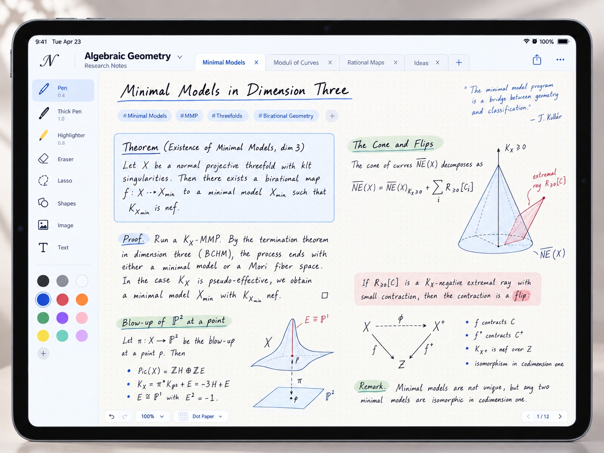

# Tablet interface

The target interface for the web app and the iPad app on a tablet-sized
screen. The four mockups below are the reference for layout, controls and
visual style. They are illustrations: the handwriting, names, counts and dates
in them are sample content, and the app is Math Notes. Phone layouts are not
specified. Where the mockups leave something open, GoodNotes and Noteful
are the reference for look and interaction.

## Screens

### Library

- **Sidebar**, always visible: app mark and name; Library, Search, Recent,
  Favorites, Trash; a Tags list with a color and a count per tag, and
  **+** to add a tag; Settings at the bottom.
- **Main pane**: title "Library" and a one-line description; **New Notebook**
  (secondary) and **New Note** (primary) buttons; a search field; a filter
  menu ("All Notebooks"); a sort menu ("Last Modified"); a grid/list toggle.
- **Notebook cards** in a grid: a thumbnail of handwritten content, the
  title, the note count, "Modified …", tag chips, and a **⋯** menu. The
  selected card has a blue outline.
- **Detail pane** for the selected notebook: a large thumbnail, title, note
  count, modified time, tag chips with **+**, **Notes** and **Info** tabs, a
  note search field, and the note list (thumbnail, title, a one-line
  summary, modified time), ending with **New Note in <notebook>**.

### New Notebook

- **Cancel** at the top left, **Create Notebook** (primary) at the top right.
- Fields: Notebook Title; Description (optional, 500-character counter);
  Paper Style (Dot, Graph, Blank, Ruled, each with a preview tile); Tags
  (removable chips and "Add a tag…"); Location (a folder menu, "You can move
  this notebook later").
- **Preview** of the cover, and **Notebook Details** summarizing paper,
  location and tag count. A cover is a preview of the notebook's first page,
  here and on every card.

### New Note

- **Cancel**; title "New Note in <notebook>"; the target notebook's
  thumbnail with **Change Notebook**.
- Fields: Title; Paper Style (Dot, Grid, Lined, Plain, Graph); Tags; Starting
  Template (Blank Note, Theorem / Proof, Grid Sketch, Lecture Notes) with a
  one-line description of the selected template.
- A large live preview of the first page with the paper and template.
- **Save as Draft** and **Create Note** (primary) at the bottom right.

### Editor

- **Top bar**: app mark; notebook title with a menu and a subtitle; a tab
  per open note with close buttons, and **+**; share and **⋯** at the right.
- **Tool rail** on the left: Pen, Thick Pen and Highlighter, each with its
  size; Eraser; Lasso; Shapes; then a color palette of 15
  swatches and **+**.
- **Page** fills the rest: dot paper, a handwritten title, tag chips with
  **+**, and ink with highlighter boxes, color and drawings.
- **Bottom bar**: undo and redo; a zoom menu ("100%"); a paper menu ("Dot
  Paper"); a page indicator "1 / 12" with previous and next.

## Pages in the editor

- Pages follow each other with no gap. In the default view a page fills the
  full width of the canvas.
- The view cannot scroll past the pages. Pulling past the end of the last page
  shows an indicator that grows with the pull. Past a threshold the indicator
  changes to confirm that a release adds a page. Releasing there adds a page
  after the last one; releasing before it adds nothing. The pull springs back
  either way.
- Ink cannot land outside a page. On pen-up, the parts of the stroke outside
  its page are removed (Noteful's behavior); a stroke entirely outside is
  removed.

## Visual style

Light theme, white and very light gray panels, one blue accent (#2F6FEB,
approximately) for primary buttons, selection and links. Rounded cards and
chips, thin gray borders, system sans-serif type. Paper is warm off-white.

## Relation to the current model

| Mockup | Current model ([FORMAT.md](../FORMAT.md), [FEATURES.md](../FEATURES.md)) |
| --- | --- |
| Paper Style, Starting Template (backgrounds) | Built-in templates: blank, lined-*, grid-*, dotted (#21) |
| Pen, Highlighter, color palette | Pen presets (#25), google/ink brushes |
| Eraser, Lasso, Shapes | #23, #24, shape recognition (#10) |
| Undo and redo, zoom, page indicator | #22, #21 |
| Tabs of open notes | A tab per open note, as in GoodNotes and Noteful |
| Trash | `Notes/.trash/` |

The mockups add the following to FORMAT.md and FEATURES.md:

1. **A notebook contains notes, and this is the directory structure.** A
   mockup "notebook" is a folder; a mockup "note" is a FORMAT.md notebook
   directory.
2. **Metadata** (description, tags with colors, a one-line summary per note,
   drafts) lives in a JSON sidecar or in the app's internal database.
3. **Content templates** are saved settings: a named configuration of the
   new-note fields (paper, size, tags, and so on) that the user saves and
   reuses. The names in the mockup are sample content.
4. **Tabs** of open notes in the editor.
5. **Search, Recent, Favorites**: not yet specified.
